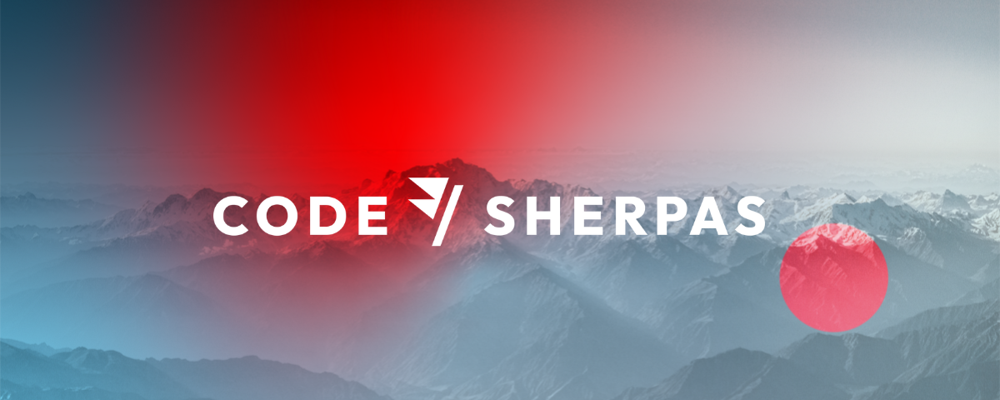

# Git Materclass

## ¿Qué vamos a hacer hoy?

Vamos a usar Git como lo hacen los mejores equipos de desarrollo en su día a día.

### ¿Cómo se hace?

- Teniendo una rama cómun para todo el mundo
- Integrando cambios pequeños frecuentemente
- Sincronizándonos con los cambios de los compañeros frecuentemente
- Garantizando que la rama común es estable todo el tiempo

### ¿Qué vamos a desarrollar?

Vamos a desarrollar un traductor Español-Klingon

¿Qué es Klingon? [Klingon video](https://youtu.be/-XTce38ef98?t=6)

#### Ya tenemos un poco de código productivo

```js
function toKlingon(spanish) {
    if(spanish == "hola") {
        return "nuqneH"
    } else if(spanish == "adiós") {
        return "maj"
    } else { spanish == "perro"
        return "Ha'DIbaH"
    }
}

module.exports = toKlingon;
```

#### También código de test

```js
const toKlingon = require('./toKlingon');

test('hola', () => {
  expect(toKlingon("hola")).toBe("nuqneH");
});

test('adiós', () => {
  expect(toKlingon("adiós")).toBe("maj");
});
test('perro', () => {
  expect(toKlingon("perro")).toBe("Ha'DIbaH");
});
```

#### Algunas traducciones de ejemplo

| Spanish        | Klingon      |
|:--------------:|:------------:|
| hola           | nuqneH       |
| adiós          | maj          |
| perro          | Ha'DIbaH     |
| gato           | mangHom      |
| negro          | qIj          |
| gato negro     | qIch         |

Algunos traductores online:

- [translator.eu/espanol/klingon/traductor/](https://www.translator.eu/espanol/klingon/traductor/)
- [tradukka.com/translate/es/tlh/?hl=es](https://tradukka.com/translate/es/tlh/?hl=es)

#### Instalación del proyecto

```bash
git clone [aquí va la URL del repositorio]
cd git-somos-coders 
npm install
```

#### Configura email y usuario (si fuera necesario)

```bash
git config user.name "John Doe"
git config user.email "johndoe@example.com"
```

#### Tests

El proyecto usa [Jest](https://jestjs.io/es-ES/) como framework de testing.

Los tests se ejecutan con `npm run tests`.

## ¿Qué hemos conseguido?

### Trunk Based development


### Continuous integration and Build automation


## Code Sherpas



### ¿Dónde puedes encontrarnos?

- Twitter: **@codesherpas_bcn**
- LinkedIn: **linkedin.com/company/code-sherpas**
- Slack: **launchpass.com/code-sherpas**
- YouTube: **Code Sherpas**
